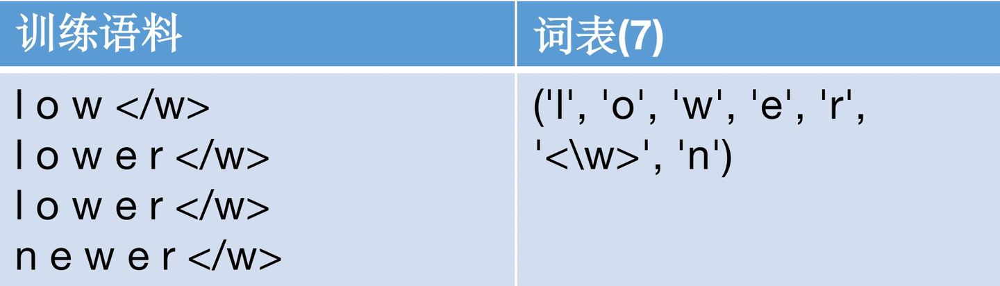
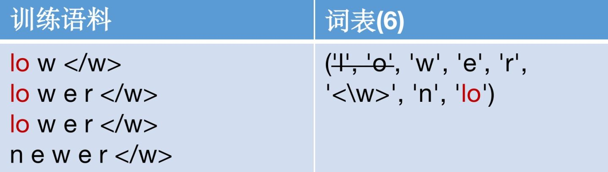
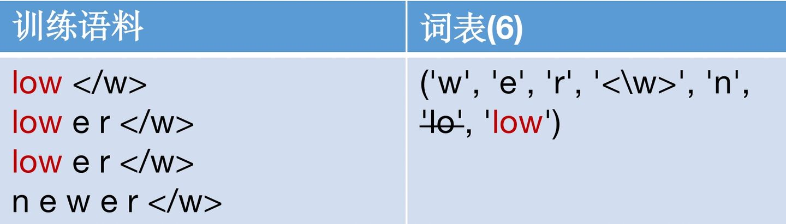
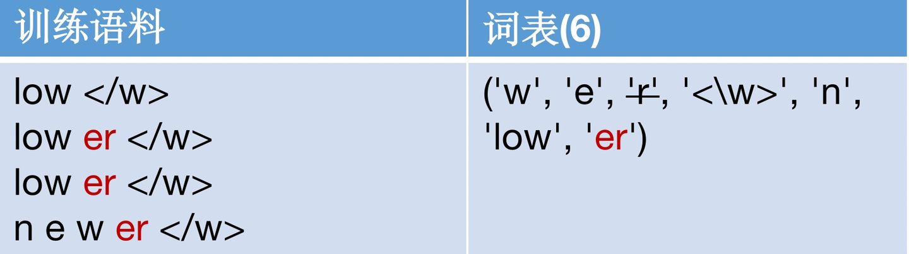
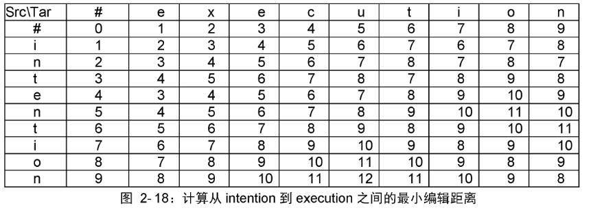
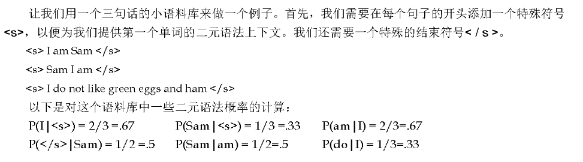

# Speech and Language processing

## Introduction

## 1. Regular Expressions, Text Normalization, Edit Distance（正则表达式、文本规范化、编辑距离）

### 1.1 Regular Expressions

#### 1.1.1 基础正则表达式模式

最简单的正则表达式是字符匹配，即把字符按顺序排序。
正则表达式是大小写敏感的，可以使用[wW]来匹配w或者W。
使用‘-’来选择一个范围，即通过[1-9]替代[123456789]。
使用‘^’表示not，通常在[]中，其中[\^wW]表示不为[wW]的字符序列。

使用‘?’在字符后表示该字符出现0次或者1次。
使用‘\*’在字符后表示该字符出现0次及以上。
使用‘+’在字符后表示该字符出现1次及以上。
使用‘.’可以表示任意一个字符。

使用‘^’在字符序列第一个表示字符开始符号。
使用‘$’在字符序列最后一个表示字符结束符号。
使用‘\\b’匹配单词边界，即左右两边至少有一个不是单词，单词即为‘\\w’，即字母、数字和下划线。
使用‘\\B’匹配非单词边界，即左右两边都是单词。
非单词不是边界、非单词与单词之间的才叫边界。

#### 1.1.2 析取、分组和优先级

disjunction：使用管道符‘|’，即cat|dog可以匹配cat或者dog。
precedence：使用‘（）’配合‘|’，即gupp(y|ies)可以匹配guppy和guppies。
opearator precedence：counter的优先级比字符序列高，字符序列的优先级别disjunction高。
greedy and non-greedy：在‘*’和‘+’后添加‘?’是非贪婪匹配。

#### 1.1.3 简单的例子

编写一个RE来查找英文文章中the得例子，一个简单得模板可能是：
/the/
有一个问题是，这种模板会漏掉以大写T开始得字符串
/[tT]he/
有一个问题，可能会检索到other等字符
/\\b[tT]he\\b/
有时可能想找后面或者前面跟着下划线或者数字得the（the_或the25）
/\[^a-zA-Z\][tT]he\[^a-zA-Z\]/
但是当the位于一行的开始就匹配不到了，一次需要增加条件
/(^|\[^a-zA-Z\])[tT]he(\[^a-zA-Z\]|$)/
上述的过程是基于修复两种错误：
- 假阳性，错误地匹配了不想要地结果 ——> 提高精确度（减少假阳性）
- 假阴性，没有匹配到想要地字符型 ——> 增加召回（最小化阴性）

#### 1.1.4 更多的操作符

|RE|Expansion|Match|
|---|---|---|
|\d|[0-9]|any digit|
|\D|\[^0-9\]|any non-digit|
|\w|[a-zA-Z0-9]|any alphanumeric/underscore|
|\W|\[^\w\]|a non-alphanumeric|
|\s|[\r\t\n\f]|whitespace|
|\S|\[^\s\]|Non-whitespace|

|RE|Match|
|---|---|
|\*|zero or more occurrences of the previous char or expression|
|+|one or more occurrences of the previous char or expression|
|?|exactly zero or one occurence of the previous char or expression|
|{n}|n occurrences of the previous char or expression|
|{n,m}|from n to m occurrences of the previous char or expression|
|{n,}|at least n occurrences of the previous char or expression|
|{,m}|up to m occurrences of the previous char or expression|

#### 1.1.5 正则表达式替换、捕捉组和ELIZA

1. 正则表达式替换：s/regexp1/pattern（经常再Python和Unix命令中使用）

```txt
s/colour/color
```

2. 再实际应用中将文本的所有数字前后加上尖括号<>，我们需要使用圆括号（）将第一个模板括起来，并在第二个模式中使用数字运算符1来回溯

```txt
s/([0-9]+)/<\1>
```

3. 括号和数字运算符还可以指定某个字符串或表达式必须在文本中出现两次

```txt
/the (.*)er they were, the \1er they will be/
匹配：The bigger they were, the bigger they will be
不能匹配：The bigger they were, the faster they will be
```

4. 使用圆括号将模式存储在内存中称为**捕获组**。每次使用捕获组（即圆括号包围模板）时，捕获组中的模板匹配到的结果将存储在一个数字编号寄存器中，通过“\数字”提取出来。如果有两个捕获组，那么\\2代表第二个捕获组匹配到的内容
5. 括号在正则表达式中具有双重功能，它们用于分组或优先级。有时我们可能希望使用圆括号用于进行分组，但不想使用捕获组的模式。在这种情况下，我们使用非捕获组，形式是在左圆括号后面加上?:即(?:模板)

```txt
/(?:some|a few) (people|cats) like some \1/
匹配：some cats like some people
不能匹配：some people like some a few
```

#### 1.1.6 前瞻断言

预测断言使用了（？语法，类似的语法我们在非捕获组的定义中看到过。操作符(?= pattern) ，表示如果模板能匹配上则该断言返回true，但为零宽度，即匹配指针不前进。操作符(?! pattern) 只有在不匹配时返回true，但同样是零宽度，不前进光标。在一些复杂的模板中，要排除一个特殊的情况时，通常使用否定的断言。例如，假设我们查找一个开头单词不是“Volcano ”的句子。我们可以用否定的预测断言来做到这一点：

```txt
/(ˆ?!Volcano)[A-Za-z]+/
```

### 1.2 Words

英语里有多少个单词，要回答这个问题，需要区分两种谈论单词的方式：
- 类型（types）：是语料库中不同单词的数量，如果词汇表中的单词集为V，则类型数量为词汇表大小|V|。
- 符记（token）：是运行单词的总数N。
- 类型数量|V|和符记数量N之间满足的关系为Herdan定律，其$k$和$\beta$为正常数，且$0 < \beta < 1$：
$$|V|=kN^{\beta}$$

### 1.3 Corpora（语料库）

- 代码转换（code switching）：语言变化是非常重要的，世界上至少有7000多种语言，在多种语言上测试算法非常重要，尤其是具有不同属性的语言；比如演讲家或作家在一次交流中使用多种语言。
- 体裁（genre）：算法处理的文本可能来自新闻专线、小说、科学文章或者口头类型等方面。
- 文本也反映了作者的人口统计学特征：年龄、性别、阶层等。
- 时间：语言会随着时间维度变化。

由于语言的位置如此重要，在开发用于从语料库进行语言处理的计算模型时，需要考虑谁在什么背景下，处于什么目的制作了语言，最好的办法时使语料库创建者为每个语料库建立一个数据表。

|属性|属性解释|
|---|---|
|动机|为什么要搜集语料库、是由谁收集、由谁提供资金？|
|情况|在什么时候、什么情况下写/说文本？|
|语言种类|语料库使用哪种语言？|
|演讲者个人背景|文字作者的年龄或性别等？|
|搜集过程|数据有多大？如果是子样本，则如何采集？是否同意收集？数据如何处理等？|
|注释过程|注释是什么？注释者的个人背景，它们是如何训练的？|
|发行|有版权或其他知识产权限制吗？|

### 1.4 Text Normalization

在对文本进行几乎任何自然语言处理之前，必须对文本进行规范化，通常需要执行三个任务：
- 符记化（分段）单词
- 规范化单词格式
- 分割句子

#### 1.4.1 用于粗糙符记化和规范化的Uinx工具

- tr：用于系统地更改输入中地特定字符
- sort：按字母顺序对输入行进行排序
- uniq：折叠并计算相邻地相同行

```bash
# tr符记化单词（“A-Za-z”表示字母，-c选项补全为非字母，-s选项压缩所有字母）序列成一个字符
tr -sc 'A-Zz-z' '\n' < sh.txt
| sort
| uniq -c
# sort -n -r
# -n为按照数字而不是字母顺序排序
# -r选项地意思是按相反顺序排序
```

#### 1.4.2 单词符记化

上述地UNIX工具可以很好地获取单词地粗略统计信息，但是对于符记化（tokenization）来说，通常更复杂地算法是必需地。
Unix命令删除了所有数字和标点符号，但是对于大多数NLP应用程序，我们需要将其其保留在标记中。

#### 1.4.3 符记化的字节对编码

大多数符记化方案有两个部分：符记学习器和符记分段器。
- 符记学习器采用原生的训练语料库，并产生一个词汇集。
- 符记分段器采用原始测试语句，并将其分段为词汇表中的符吉。

其中三种算法被广泛使用：字节对编码（Sennrich等人，2016），一元语法（unigram）语言建模（Kudo，2018）和WordPiece（Schuster和Nakajima，2012）。
本节介绍其中最简单的编码，即**字节对编码（BPE）算法**：

```c
function Byte-pair Encoding(string C, number of merges k) returns vocab v

v <- all unique characters in C
for i = 1 to k do
	tL, tR <- Most frequent pair of adjacent tokens in C
	tNEW <- tL + tR
	V <- V + tNEW  # update the vocabulary
	Replace each occurrence of tL, tR in C with tNEW
return V
```

1. BPE符记学习器从一个词汇开始，该词汇只是所有单个字符的集合
2. 检测训练语料库，选择最经常相邻的两个符号（例如“A”，“B”），在该词汇表中添加新的合并符号“AB”，并用新“AB”替换语料库中的每个相邻的“A”，“B”
3. 继续计数和合并，创建越来越长的新字符，直到完成k个合并位置，创建了k个新颖的符记
4. 最终的符记粒度在字符和单词之间






#### 1.4.4 单词规范化，词形还原和词干化

- 单词规范化（normalization）的任务是将单词/符记置于标准格式中，为具有多种形式的单词（如USA和US）选择单一标准格式，尽管在标准化过程中丢失了拼写信息，但这种标准化可能是由价值的。
- 大小写折叠（case folding）是另一种规范化。将所有内容映射为小写，这对于许多任务（信息检索或语言识别）的概况非常有帮助。不过对于情感分析和其他分类任务，信息提取和机器翻译的影响较大。
- 词形还原（Lemmatization）是确定两个词尽管表面存在差异但具有相同词根的任务。比如am，are和is具有共同的词元be。
	- 最复杂的词形还原方法包括单词的完整形态解析。形态学是这样一种方式的研究，在这种方式中，词是由更小的承载意义的单位--语素（morpheme）构成的。可以将词素分为两大类：词干（词的中心词素，提供主要含义）和词缀（添加各种“附加”含义）。
- **Porter（波特）词干分析器**
	- 词形还原算法可能很复杂，出于这个原因，我们有时会使用一种更简单但更粗糙的方法，主要包括去掉词尾词缀。这种朴素的形态分析版本称为词干分析（stemming）。
```txt
原：his was not the map we found in Billy Bones’s chest, but an accurate copy, complete in all things-names and heights and soundings-with the single exception of the red crosses and the written notes.
译：Thi wa not the map we found in Billi Bone s chest but an accur copi complet in all thing name and height and sound with the singl except of the red cross and the written note
```

#### 1.4.5 句子分割

**句子分割（sentence segmentation）**：是文本处理处理的一个重要步骤。把一篇文字切分成句子最有用的线索就是标点符号，比如句号、问号和感叹号。

### 1.5 Minimum Edit Distance

测量两个字符串的相似程度，半段两个字符串是否引用同一实体的任务。

#### 1.5.1 最小编辑距离算法

最小编辑距离算法被Wagner和Discher（1974）命名，但被许多人独立发现。首先定义两个字符串之间的最小编辑距离。给定两个字符串，长度为n的源字符串X和长度为m的目标字符串Y，我们将D[i,j]定义为X[1..i]和Y[1..j]之间的编辑距离，即X的前i个字符和Y的前j个字符。以此X和Y之间的编辑距离为D[n,m]。
$$
D[i,j]=min
\begin{cases}
D[i-1,j]+del-cost(source[i]) \\
D[i,j-1]+ins-cost(source[j]) \\
D[i-1,j-1]+sub-cost(source[i],target[j])
\end{cases}
\tag{1}
$$
假设Levenshtein距离的版本，插入和删除的成本分别为1，替换的成本为2（处理替换相同字母的成本为0），则S[i,j]的计算为：
$$
D[i,j]=min
\begin{cases}
D[i-1,j] + 1 \\
D[i, j-1] + 1 \\
D[i-1, j-1] +
	\begin{cases}
	2; if source[i] \neq target[j] \\
	0; if source[i] = target[j]
	\end{cases}
\end{cases}
\tag{2}
$$
```c
function min-edit-distance(source, target) return min-distance

n <- length(source)
m <- length(target)
create a distance matrix distance[n+1, m+1]

D[0, 0] = 0
for each row i from 1 to n do
	D[i, 0] <- D[i-1, 0] + del - cost(source[i])
for each column j from 1 to m do
	D[0, j] <- D[0, j-1] + ins - cost(target[j])
for each row i from 1 to n do
	for each column j from 1 to m do
		D[i, j] <- MIN(D[i-1, j] + del - cost(source[i]),
					   D[i-1, j-1] + sub - cost(source[i], target[j]),
					   D[i, j-1] + ins - cost(target[j]))
return D[n, m]
```



### 1.6 Summary

本章介绍了语言处理中的一个基本工具，正则表达式，并展示了如何执行基本的文本规范化任务，包括分词和规范化、句子分割和词干提取。
- 正则表达式语言是模式匹配的强大工具。
- 正则表达式的基本操作包括连接符号，析取符号（[]，|，和。），计数器（*,+,和{n,m}），定位符（^，$）和优先操作符（(,)）。
- 单词符记化和规范化通常是由级联的简单正则表达式替换有限自动机
- Porter（波特）算法是一个简单而有效的方法，用来做词干提取、剥离词缀。它的精度不高，但可能对某些任务有用。
- 两个字符串之间的最小编辑距离是将一个字符串编辑为另一个字符串所需的最小操作符。

## 2. N-gram Language Models

### 2.1 N-Grams

从计算P(w|h)的任务开始，即：在给定历史h的条件下，计算单词w的概率。假设历史h是“its water is so transparent that”，我们想知道下一个单词是“the”的概率：
$$
P(the|its \ water \ is \ so \ transparent \ the)
\tag{2.1}
$$
估计这个概率的一种方法是通过相对频率计数：取一个非常大的语料库，计算我们看到“its water is so transparent that”的次数，并计算它后面跟着“the”的次数。这就可以回答“根据我们看到历史h的次数，由多少次它后面跟着w”，如下所示：
$$
P(the | its \  water \ is \ so \ transparent \ that)
= \frac{Count(its \ water \ is \ so \ transparent \ that \ the)}{Count(its \ water \ is \ so \ transparent \ that)}
\tag{2.2}
$$
有足够大的语料库，如web，我们可以计算这些技术，并根据公式3.2估计概率。但是因为语言具有创造力，即使是例句的简单扩展，在web上也可能出现0的计数。
处于这些原因，我们需要引入更聪明的方法来估计在给定历史h条件下的单词w的概率然后通过链式规则分解整个$P(w_1,w_2,\cdots,w_n)$这样的整个序列的概率：
$$
P(X_1...X_n)=P(X_1)P(X_2|X_1)P(X_3|X_{1:2})...P(X_n|X_{1:n-1})=\prod_{k=1}^{n}P(X_k|X_{1:k-1})
\tag{2.3}
$$
运用链式法则，我们得到：
$$
P(w_{1:n})=P(w_1)P(w_2|w_1)P(w_3|w_{1:2})...P(w_n|w_{1:n-1})=\prod_{k=1}^{n}P(w_k|w_{1:k-1})
\tag{2.4}
$$
链式规则展示了计算一个序列的联合概率和计算在给定前一个单词的情况下的条件概率之间的联系。但是给定一长串前面的单词，我们没有任何办法可以计算出一个单词的确切概率，正如上面所说的，我们不能仅仅通过计算每个单词在每个长字符串后面出现的次数来估计，因为语言是有创造性的，任何特定的上下文可能以前**从未出现过**！
**n元语法模型**的直觉是，与其在给定全部单词历史记录的情况下计算单词的概率，不如仅仅通过最后几个单词来估计历史记录。
例如，**二元语法（bigram）模型**仅通过使用一个先前单词$P(w_n|w_{n-1})$的条件概率来近似所有先前单词$P(w_n|w_{1:n-1})$的单词的概率。换句话说，不是计算概率：
$$
P(the | Walden \ Pond's \ water \ is \ so \ transparent \ that)
\tag{2.5}
$$
而是使用下面的概率来近似计算：
$$
P(the|that)
\tag{2.6}
$$
以此，当我们使用bigram模型来预测下一个单词的条件概率时，我们可以做出如下近似：
$$
P(w_n|w_{1:n-1})\approx P(w_n|w_{n-1})
\tag{2.7}
$$
一个词的概率只取决于前一个词的假设被成为**马尔可夫（Markov）假设**。马尔可夫模型是概率模型的一类，它们假定我们可以预测某些未来的概率而不会过多地考虑过去。我们可以将二元语法（想过去看一个单词）推广到三元语法（向过去看两个单词），然后推广到**n元语法（n-gram）**（向过去看n-1个单词）
因此，这个n元近似的序列这种下一个单词的条件概率的一般方程是：
$$
P(w_n|w_{1:n-1}) \approx P(w_n|w_{n-N+1:n-1})
\tag{2.8}
$$
在给定单个凡此概率的二元语法假设的情况下，我们可以通过将公式2.7带入公式2.4计算出全部单词序列的概率：
$$
P(w{1:n})=\prod_{k=1}^nP(w_k|w_{1:k-1})
\tag{2.9}
$$
如何估计这些二元或n元语法概率？估计概率的一种直观方法称为**最大似然估计（MLE）**。我们通过从语料库中获取计数，并对计数进行**归一化（normalize）**，使它们位于0-1之间，从而获取n-gram模型参数的MLE估计。
$$
P(w_n|w_{n-1})=\frac{C(w_{n-1}w_n)}{\sum_{w}C(w_{n-1}w)}
\tag{2.10}
$$
可以简化此等式，因为以给定单词$w_{n-1}$开头的所有二元语法计数的总和必须等于该单词$w_{n-1}$的一元语法计数：
$$
P(w_n|w_{n-1})=\frac{C(w_{n-1}w_n)}{C(W_{n-1})}
\tag{2.11}
$$

对于MLE n-gram参数的一般情况：
$$
P(w_n|w_{n-N+1:n-1})=\frac{C(w_{n-N+1:n-1}w_n)}{C(W_{n-N+1:n-1})}
\tag{2.12}
$$
一些实际问题：在实践中，更常见的是使用三元语法（trigram），或者数据更多时使用4-gram甚至5-gram模型。
通常使用对数概率的形式来表示和计算语言模型的概率，否则容易导致数字下溢。最后报告时在使用exp转回概率。
$$
p_1 \times p_2 \times p_3 \times p_4 = \exp(\log{p_1} + \log{p_2} + \log{p_3} + \log{p_4})
\tag{2.13}
$$

### 2.2 评估语言模型

评估语言模型性能的最佳方法是将其嵌入到应用程序中，并衡量应用程序的改进程度。这种端到端的评估称为**外部评估**（extrinsitc evaluation）。外部评估是了解某个组件的特定改进是否真的会帮助完成手头任务的唯一方法。
不幸的是，端到端的运行大型NLP系统非常昂贵。一个**内在评估**（intrinsic evalaution）的度量是一个独立于任何应用程序的模型质量的测量。
对于语言模型的内在评估，我们需要一个测试集。n-gram模型的概率来自于它所受训练的语料库，即**训练集**。然后通过n-gram模型在**测试集**上的性能来衡量其质量。有时将不在训练集中测试集和起他数据集称为保留**语料库**。
有时，我们过于频繁地使用一个特定的测试集，以致于我们隐式地调整了它地特征。因此需要一个新的测试集，一个真正看不见地测试集，我们称为**开发测试集**。在实践中，我们通常只是将我们地数据分为80%的训练、10%的开发和10%的测试。

#### 2.2.1 困惑度

## 3. Naive Bayes and Sentiment Classification（朴素贝叶斯与情感分类）

## 4. Logistic Regression

## 5. Vector Semantics and Embeddings（向量语义和嵌入）

## 6. Neural Networks and Neural Language Models 

## 7. Sequence Labeling for Parts of Speech and Named Entities（词性和命名实体识别的序列标注）

## 8. Deep Learning Architectures for Sequence Processing（序列处理的深度学习架构）

## 9. Machine Translation and Encoder-Decoder Models

## 10. Transfer Learning with Pretrained Language Models and Contextual Embeddings（基于预训练语言模型和上下文嵌入的迁移学习）

## 11. Constituency Grammars（选区语法）

## 12. Constituency Parsing（选取解析）

## 13. Dependency Parsing

## 14. Logical Representations of Sentence Meaning（句子意义的逻辑表征）

## 15. Computational Semantics and Semantic Parsing（计算语义和语义解析）

## 16. Information Extraction

## 17. Word Senses and WordNet

## 18. Semantic Role Labeling

## 19. Lexicons for Sentiment, Affect, and Connotation

## 20. Coreference Resolution（算法）

## 21. Discourse Coherence（语篇连贯）

## 22. Question Answering

## 23. Chatbots & Dialogue Systems（聊天机器人和对话系统）

## 24. Phonetics（语音学）

## 25. Automatic Speech Recognition and Text-to-Speech
